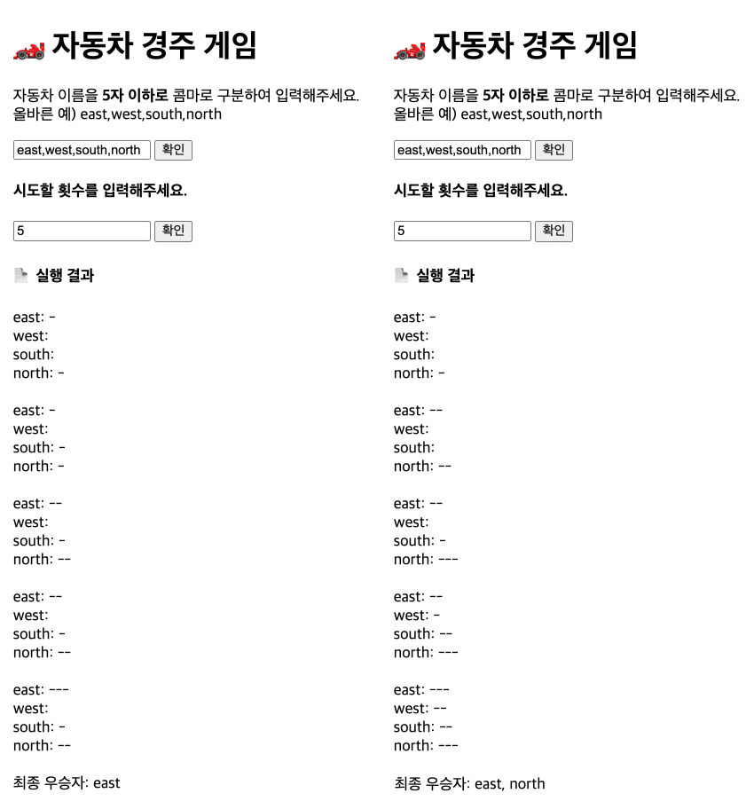

## 📍기능 요구 사항

1. 주어진 횟수 동안 n 대의 자동차는 전진 또는 멈출 수 있다.
2. 자동차에 이름을 부여할 수 있다. 전진하는 자동차를 출력할 때 자동차 이름을 같이 출력한다.
3. 자동차 이름은 쉼표(,)를 기준으로 구분하며 이름은 5자 이하만 가능하다.
4. 사용자는 몇 번의 이동을 할 것인지를 입력할 수 있어야 한다.
5. 전진하는 조건은 0에서 9 사이에서 무작위 값을 구한 후 무작위 값이 4 이상일 경우이다.
6. 자동차 경주 게임을 완료한 후 누가 우승했는지를 알려준다. 우승자는 한 명 이상일 수 있다.
7. 우승자가 여러 명일 경우 쉼표(,)를 이용하여 구분한다.
8. 사용자가 잘못된 입력 값을 작성한 경우 alert을 이용해 메시지를 보여주고, 다시 입력할 수 있게 한다.

## 🌈 실행결과

## 프로그래밍 요구사항

1. 주어진 index.html에 html엘리먼트를 추가하거나 기존 html엘리먼트를 삭제하지 않는다. id, class 추가는 허용한다.
2. webpack, babel을 제외한 npm 라이브러리는 사용하지 않는다.(webpack, babel은 사용해도되고, 사용하지 않아도 된다.)
3. import문을 통해 모듈화 한다.
   [label](https://developer.mozilla.org/ko/docs/Web/JavaScript/Reference/Statements/import)
